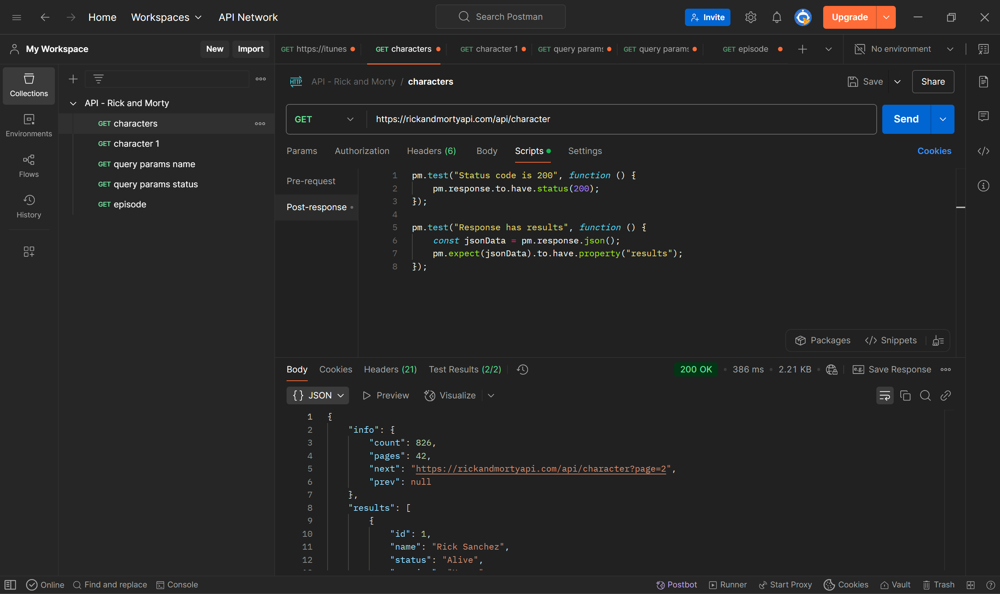
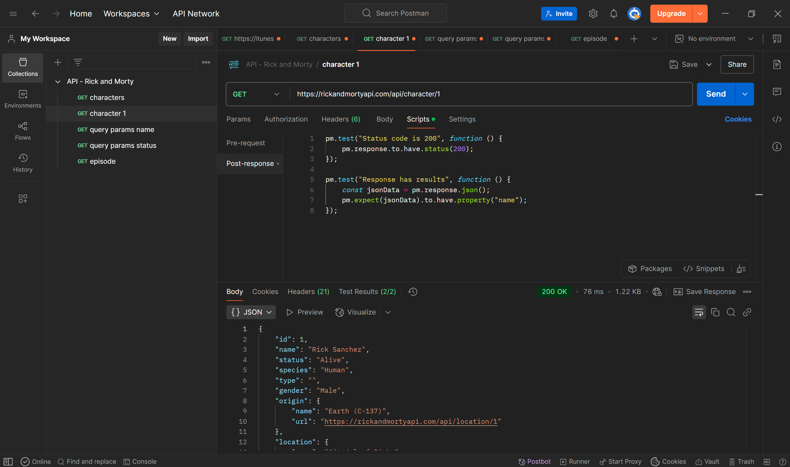
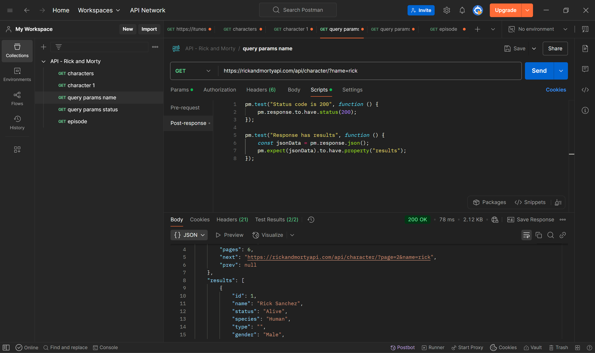
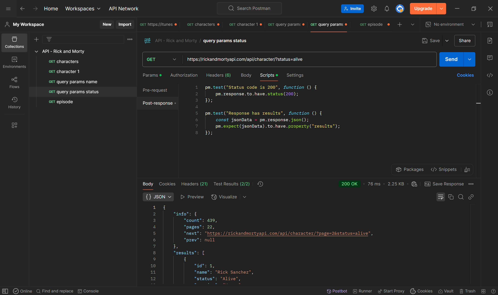
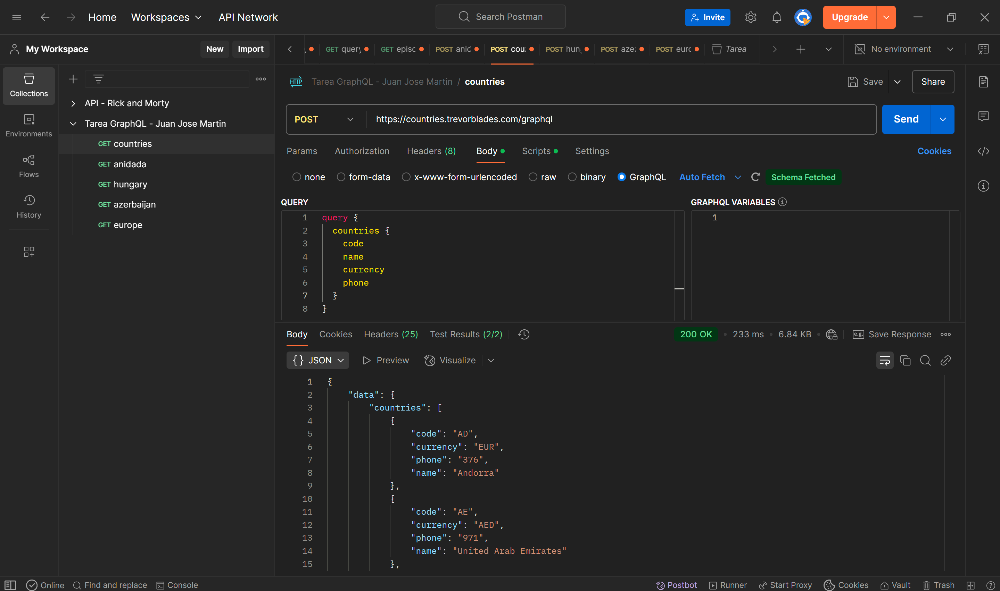
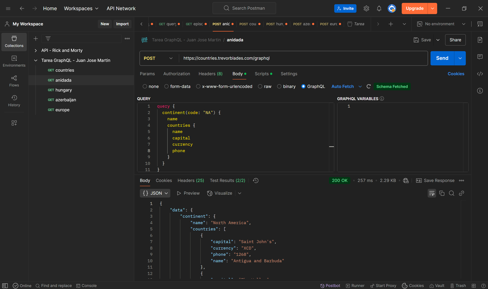
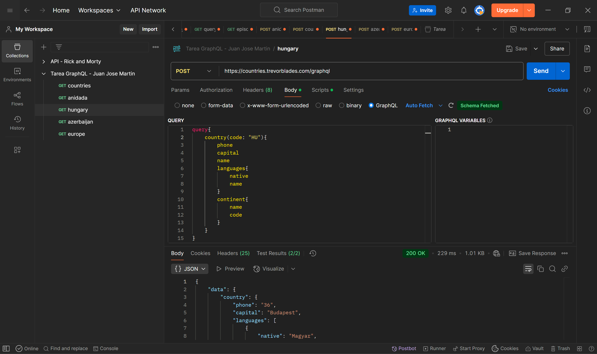
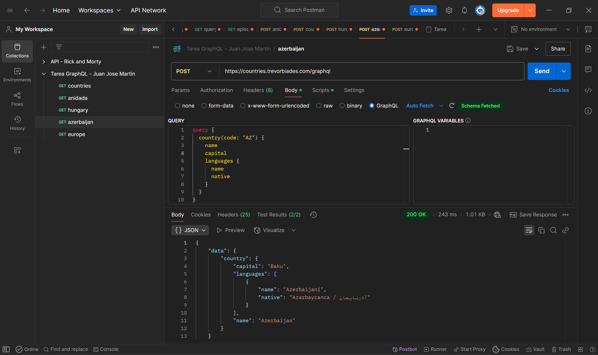
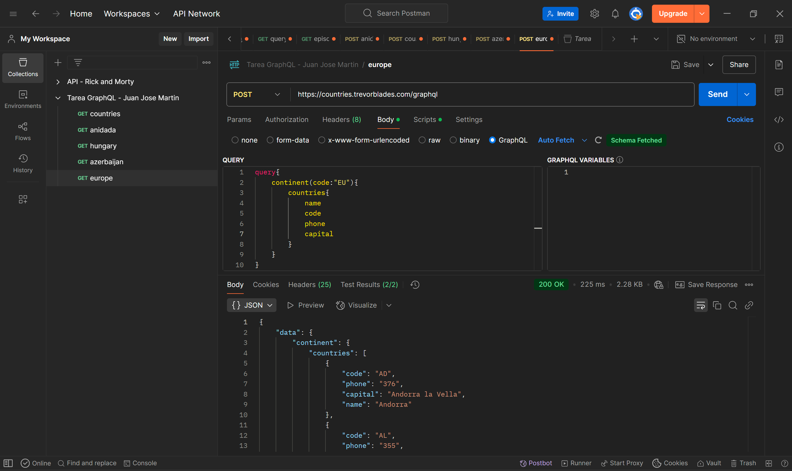
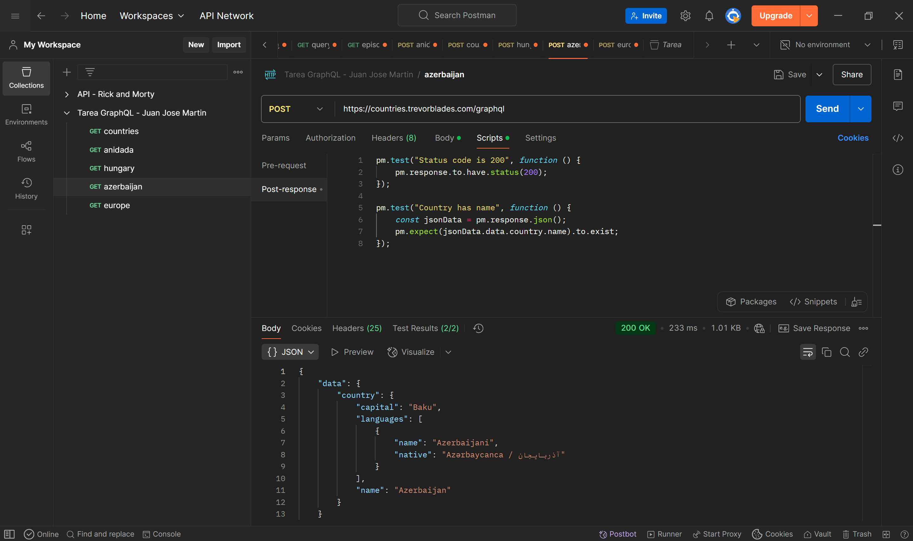

# Tarea API

## Estudiante

Juan José Martin

---

# Parte 1: API REST

## ¿Qué API elegiste y por qué?

Se utilizó la API pública de Rick and Morty.

https://rickandmortyapi.com/api

## ¿Por qué se eligió esta API?

Se eligió esta API porque es gratuita, no requiere autenticación y permite trabajar con endpoints claros. Además, ofrece soporte para filtros mediante query parameters, lo cual facilita el cumplimiento de los requisitos de la actividad.

## ¿Qué datos devuelve?

La API devuelve información en formato JSON de:

* Personajes 
* Episodios

## ¿Usa token o no? ¿Qué tipo?

No, es una API pública que no requiere autenticación ni uso de tokens.

## Requests realizados

A continuación se presentan los requests realizados en Postman:

### 1. Obtener todos los personajes



### 2. Obtener un personaje por ID



### 3. Obtener personajes usando query parameters (name=rick)



### 4. Obtener personajes filtrados por estado (status=alive)



### 5. Obtener episodios


## ¿Qué código de estado recibiste en cada request?

* 200 (OK): para solicitudes exitosas

## ¿Qué aprendiste diferente a JSONPlaceholder?

* Uso de query parameters para filtrar resultados
* Estructuras JSON más complejas y con relaciones

# Parte 2: GraphQL

## API utilizada

https://countries.trevorblades.com/graphql

## Queries realizadas

Se realizaron cinco consultas en Postman utilizando GraphQL:

### 1. Obtener todos los países



### 2. Consulta anidada (continente y países)



### 3. Obtener un país por código (Hungria)
 


### 4. Obtener lenguas de un país (Azerbaijan)



### 5. Consultar paises de un continente (Europa)



## ¿Qué diferencia encontraste vs REST?

La principal diferencia es que en REST se utilizan múltiples endpoints para obtener distintos recursos, mientras que en GraphQL se utiliza un único endpoint que permite solicitar exactamente los datos necesarios.

GraphQL evita el envío de información innecesaria y permite realizar consultas más eficientes.

## ¿Cuántos requests REST necesitarías para reemplazar tu query más compleja?

Dependiendo de la información solicitada, se requerirían bastantes (más de uno sin duda) requests en REST para obtener los mismos datos que una sola consulta de GraphQL puede proporcionar.

## ¿En qué proyecto real usarías GraphQL?

Usaria GraphQL para consultas que requieran mucha informacion realcionada, asi optimizar el tiempo y la cantidad de consultas a realizar.

Seria muy util en:

*Aplicaciones con datos relacionados
*Aplicaciones móviles donde se requiere optimizar el consumo de datos
*Dashboards interactivos
*Sistemas complejos con múltiples entidades
## Tests implementados

Se implementaron pruebas automáticas en Postman para validar las respuestas de GraphQL. Ejemplo:

```javascript
pm.test("Status code is 200", function () {
    pm.response.to.have.status(200);
});

pm.test("Data exists", function () {
    const jsonData = pm.response.json();
    pm.expect(jsonData.data).to.exist;
});
```
---
### Ejemplo test:



# Entregables

* Colección REST exportada (JSON)
* Colección GraphQL exportada (JSON)
* Evidencias en imágenes de cada request
