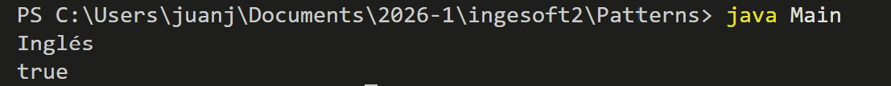
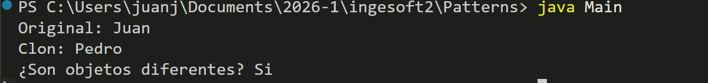
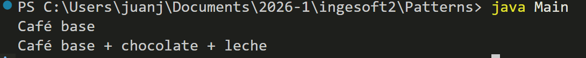
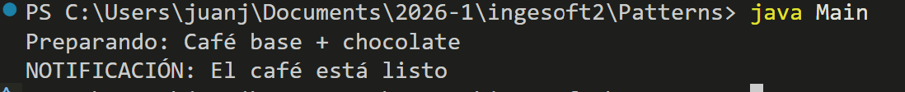

# Patrones de diseño

#### SINGLETON

En este ejemplo, se me acurrio crear una clase llamada `Configuracion` que almacenará configuraciones globales de la aplicación. En los dispositivos mobiles es muy común que la configuracion global se aplique para todo el dispositivo y solo haya una unica configuración global activa.

```java
class Configuracion {

    // Instancia única
    private static Configuracion instancia;

    // Variables globales
    private String idioma;
    private String tema;

    // Constructor privado
    private Configuracion() {
        idioma = "Español";
        tema = "Oscuro";
    }

    // Método para obtener la única instancia
    public static Configuracion getInstancia() {

        if (instancia == null) {
            instancia = new Configuracion();
        }

        return instancia;
    }

    // Getters y setters
    public String getIdioma() {
        return idioma;
    }

    public void setIdioma(String idioma) {
        this.idioma = idioma;
    }

    public String getTema() {
        return tema;
    }

    public void setTema(String tema) {
        this.tema = tema;
    }
}

public class Main {

    public static void main(String[] args) {

        // Primera referencia
        Configuracion config1 = Configuracion.getInstancia();

        // Modificar datos
        config1.setIdioma("Inglés");

        // Segunda referencia
        Configuracion config2 = Configuracion.getInstancia();

        // Mostrar idioma
        System.out.println(config2.getIdioma());

        // Comparar referencias
        System.out.println(config1 == config2);
    }
}
```

#### SALIDA



El patrón de diseño **Singleton** es un patrón creacional cuyo objetivo es garantizar que una clase tenga **una única instancia** durante toda la ejecución del programa.

#### Características principales:

- Solo puede existir un objeto de la clase.
- La propia clase controla su creación.
- Se utiliza un método estático para acceder a la instancia.
- El constructor se vuelve privado para evitar nuevas instancias.

Aunque creemos dos variables diferentes, ambas apuntarán al mismo objeto.

---

#### PROTOTYPE

El **Prototype** es un patrón creacional que permite **copiar/clonar** objetos existentes sin depender de sus clases concretas.

```java
class Persona implements Cloneable {

    private String nombre;
    private int edad;

    public Persona(String nombre, int edad) {
        this.nombre = nombre;
        this.edad = edad;
    }

    // Método clone
    public Persona clone() {
        return new Persona(this.nombre, this.edad);
    }

    public String getNombre() {
        return nombre;
    }

    public void setNombre(String nombre) {
        this.nombre = nombre;
    }

    public int getEdad() {
        return edad;
    }

    public void setEdad(int edad) {
        this.edad = edad;
    }
}

public class Main {

    public static void main(String[] args) {

        Persona original = new Persona("Juan", 25);

        // Clonar objeto
        Persona clon = original.clone();

        // Modificar clon
        clon.setNombre("Pedro");

        // Mostrar resultados
        System.out.println("Original: " + original.getNombre());
        System.out.println("Clon: " + clon.getNombre());

        // Comparar referencias
        System.out.println("¿Son objetos diferentes? " + (original != clon));
    }
}
```

#### SALIDA



Características principales:

- Permite crear copias de objetos sin conocer su clase exacta
- El método clone() crea un nuevo objeto con los mismos valores
- Útil cuando crear objetos es costoso (ej: base de datos, configuración compleja)
  En este ejemplo, original y clon son objetos diferentes con los mismos datos iniciales, pero el clon puede modificarse sin afectar al original.

---

#### PROTOTYPE + DECORATOR

- **Prototype** (patrón creacional)
- **Decorator** (patrón estructural)

Simularemos un sistema de cafetería donde:

1. Existe un café base.
2. El café puede clonarse rápidamente usando Prototype.
3. Luego se le pueden agregar ingredientes usando Decorator.

```java
interface Cafe {

    String descripcion();
}

// Prototype
class CafeBase implements Cafe, Cloneable {

    @Override
    public String descripcion() {
        return "Café base";
    }

    // Método Prototype
    public CafeBase clone() {
        return new CafeBase();
    }
}

// Decorator base
abstract class CafeDecorator implements Cafe {

    protected Cafe cafe;

    public CafeDecorator(Cafe cafe) {
        this.cafe = cafe;
    }
}

// Decorator de leche
class LecheDecorator extends CafeDecorator {

    public LecheDecorator(Cafe cafe) {
        super(cafe);
    }

    @Override
    public String descripcion() {
        return cafe.descripcion() + " + leche";
    }
}

// Decorator de chocolate
class ChocolateDecorator extends CafeDecorator {

    public ChocolateDecorator(Cafe cafe) {
        super(cafe);
    }

    @Override
    public String descripcion() {
        return cafe.descripcion() + " + chocolate";
    }
}

public class Main {

    public static void main(String[] args) {

        // Café original
        CafeBase original = new CafeBase();

        // Clonar café usando Prototype
        CafeBase clon = original.clone();

        // Decorar el clon
        Cafe cafeDecorado = new LecheDecorator(
                new ChocolateDecorator(clon));

        // Mostrar resultados
        System.out.println(original.descripcion());
        System.out.println(cafeDecorado.descripcion());
    }
}

```

#### SALIDA



#### PROTOTYPE + DECORATOR + OBSERVER

- **Prototype** (patrón creacional)
- **Decorator** (patrón estructural)
- **Observer** (patrón de comportamiento)

Simularemos un sistema de cafetería donde:

1. Se crea un café base.
2. El café puede clonarse rápidamente usando Prototype.
3. Luego se le pueden agregar ingredientes usando Decorator.
4. Se muestra una notificación cuando el cafe esta listo usando Observer.

```java
// ==========================
// INTERFAZ DEL CAFÉ
// ==========================
interface Cafe {

    String descripcion();
}

// ==========================
// PROTOTYPE
// ==========================
class CafeBase implements Cafe, Cloneable {

    @Override
    public String descripcion() {
        return "Café base";
    }

    // Clonar café
    public CafeBase clone() {
        return new CafeBase();
    }
}

// ==========================
// DECORATOR BASE
// ==========================
abstract class CafeDecorator implements Cafe {

    protected Cafe cafe;

    public CafeDecorator(Cafe cafe) {
        this.cafe = cafe;
    }
}

// ==========================
// DECORATOR DE CHOCOLATE
// ==========================
class ChocolateDecorator extends CafeDecorator {

    public ChocolateDecorator(Cafe cafe) {
        super(cafe);
    }

    @Override
    public String descripcion() {
        return cafe.descripcion() + " + chocolate";
    }
}

// ==========================
// OBSERVER
// ==========================
interface Observer {

    void actualizar();
}

// ==========================
// OBSERVER CONCRETO
// ==========================
class Pedido implements Observer {

    @Override
    public void actualizar() {

        System.out.println(
            "NOTIFICACIÓN: El café está listo"
        );
    }
}

class PedidoCafe {

    private Cafe cafe;

    // Solo un observer
    private Observer observer;

    public PedidoCafe(Cafe cafe) {
        this.cafe = cafe;
    }

    // Registrar observer
    public void setObserver(Observer observer) {
        this.observer = observer;
    }

    // Preparar café
    public void prepararCafe() {

        System.out.println(
            "Preparando: "
            + cafe.descripcion()
        );

        // Notificar
        observer.actualizar();
    }
}
public class Main {

    public static void main(String[] args) {

        // ==========================
        // PROTOTYPE
        // ==========================
        CafeBase original = new CafeBase();

        CafeBase clon = original.clone();

        // ==========================
        // DECORATOR
        // ==========================
        Cafe cafeDecorado =
                new ChocolateDecorator(clon);

        // ==========================
        // OBSERVER
        // ==========================
        Pedido pantalla =
                new Pedido();

        PedidoCafe pedido =
                new PedidoCafe(cafeDecorado);

        pedido.setObserver(pantalla);

        // Preparar pedido
        pedido.prepararCafe();
    }
}
```

#### SALIDA


