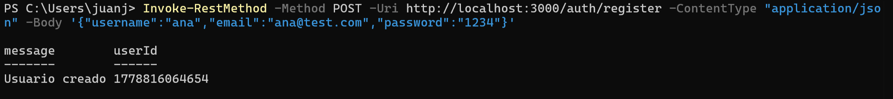
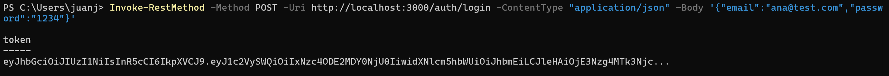
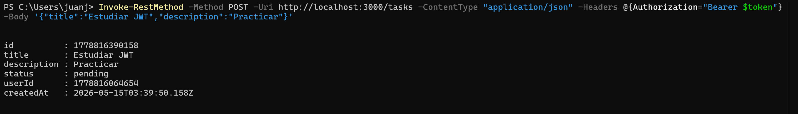
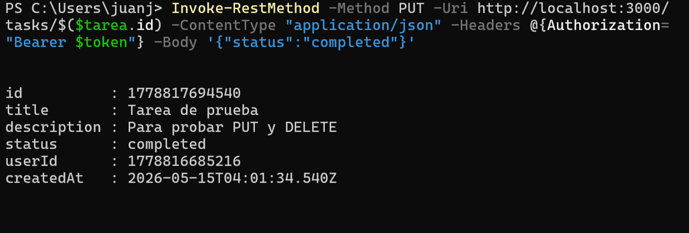
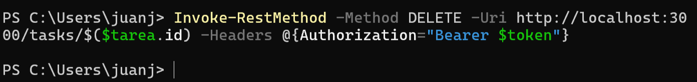
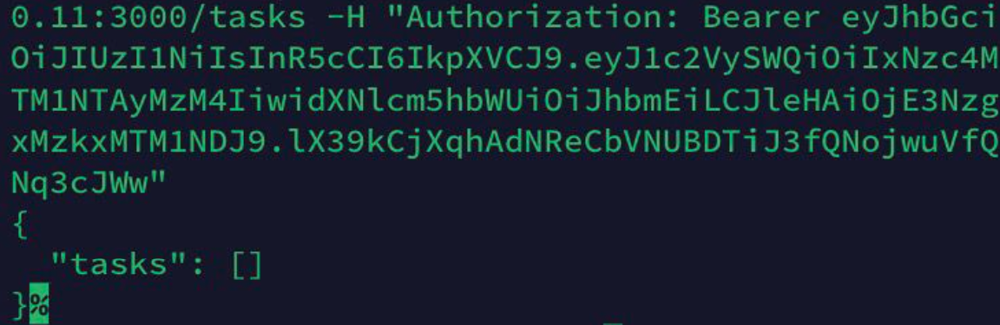

# SSH

## 1) Clase

### Objetivo

Consumir la API desde la terminal (powershell) y validar los endpoints de autenticacion y tareas.

### Requests realizados

| #   | Request     | Endpoint         | Status Code | Observacion                      |
| --- | ----------- | ---------------- | ----------- | -------------------------------- |
| 1   | Register    | `/auth/register` | 201         | Crea usuario y devuelve `userId` |
| 2   | Login       | `/auth/login`    | 200         | Devuelve `token` JWT             |
| 3   | Create task | `/tasks`         | 201         | Crea tarea con `status: pending` |
| 4   | Update task | `/tasks/:id`     | 200         | Cambia estado a `completed`      |
| 5   | Delete task | `/tasks/:id`     | 204         | Elimina la tarea                 |

### Resultados

#### Register

- Se registra un nuevo usuario y la API devuelve el `userId` para identificarlo.
- **Request:** `POST /auth/register`
- **Status code:** 201
- **Respuesta (JSON):**

#### Login

- Se autentica el usuario creado y se obtiene el token JWT que se usa en los endpoints protegidos.
- **Request:** `POST /auth/login`
- **Status code:** 200
- **Respuesta (JSON):**

#### Create task

- Se crea una tarea asociada al usuario autenticado, con estado inicial `pending`.
- **Request:** `POST /tasks`
- **Status code:** 201
- **Respuesta (JSON):**

#### Update task (PUT)

- Se actualiza el estado de la tarea creada a `completed` usando su `id`.
- **Request:** `PUT /tasks/:id`
- **Status code:** 200
- **Respuesta (JSON):**

#### Delete task

- Se elimina la tarea creada y el servidor responde sin contenido.
- **Request:** `DELETE /tasks/:id`
- **Status code:** 204
- **Respuesta:** No Content

## 2) SSH

### Objetivo

Consumir la API desde otro dispositivo usando un tunel SSH (Termius en este caso, porque se hace desde un iPhone).

### Teoria breve

- SSH crea un canal cifrado entre dos equipos.
- El port forwarding expone el puerto 3000 del computador como si fuera local en el iPhone.
- Termius permite abrir el tunel y ejecutar requests contra `http://localhost:3000`.

### Requests realizados

| #   | Request     | Endpoint         | Status Code | Observacion                     |
| --- | ----------- | ---------------- | ----------- | ------------------------------- |
| 1   | Register    | `/auth/register` | 201         | Usuario creado desde iPhone     |
| 2   | Login       | `/auth/login`    | 200         | Token generado desde iPhone     |
| 3   | Create task | `/tasks`         | 201         | Tarea creada desde iPhone       |
| 4   | Update task | `/tasks/:id`     | 200         | Estado actualizado desde iPhone |

### Resultados

#### Tunel SSH

- Se obtiene la IP local del computador y se abre el tunel en Termius.
- A partir de esto, las requests se ejecutan contra `http://localhost:3000` desde el iPhone.

#### Validacion de endpoints

- El flujo de register, login, POST y PUT responde igual que en la Parte 1.
- Se confirma que el token viaja por el tunel y permite acceder a endpoints protegidos.

#### Create task

